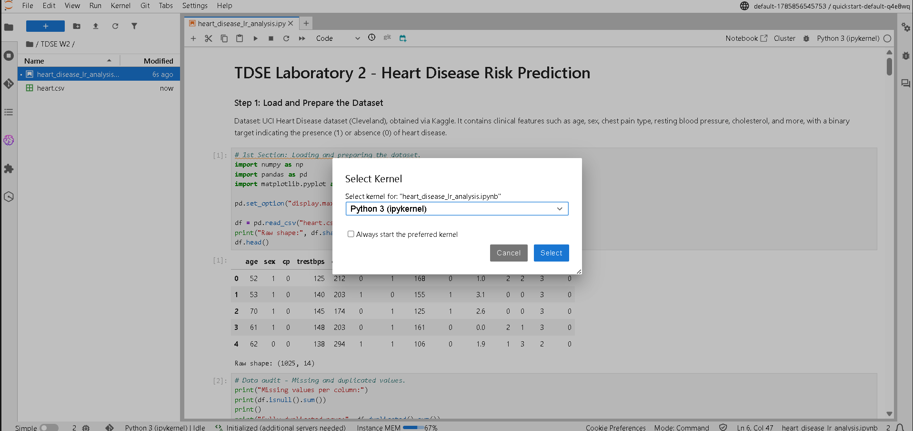
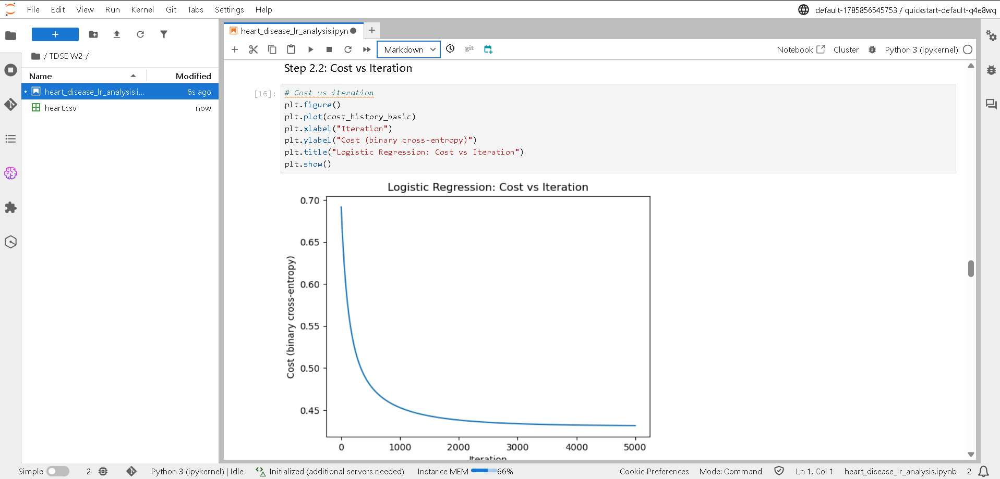
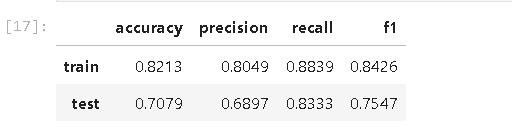

# Heart Disease Risk Prediction — Logistic Regression from First Principles
 
Author - Julian Santiago Ramirez Urueña.
 
This project implements logistic regression from scratch (no ML libraries)
to predict the presence of heart disease from clinical features. It covers
exploratory data analysis and cleaning, vectorized model training via
gradient descent, decision-boundary visualization, L2 regularization, and
model training and testing on Amazon SageMaker.
 
## Dataset
 
Kaggle Heart Disease dataset (a processed copy of the UCI Cleveland Heart
Disease dataset), containing clinical features such as age, sex, chest
pain type, resting blood pressure, cholesterol, and more, with a binary
target indicating the presence (1) or absence (0) of heart disease.
 
Source: https://www.kaggle.com/datasets/neurocipher/heartdisease
 
## Requirements
 
- Python 3
- NumPy
- Pandas
- Matplotlib
## How to Run
 
1. Clone this repository.
2. Install the dependencies: `pip install numpy pandas matplotlib`.
3. Open `heart_disease_lr_analysis.ipynb` in Jupyter and click on "run all".
## Main Result
 
The raw Kaggle file contains 1025 rows, but 723 are exact duplicates and 6
more carry invalid `ca`/`thal` codes; after cleaning, 296 unique patient
records remain. A logistic regression model trained from scratch on six
standardized clinical features (`age`, `chol`, `trestbps`, `thalach`,
`oldpeak`, `ca`) reaches ~82% train accuracy and ~71% test accuracy, with
no sign of severe overfitting. Decision-boundary visualizations on feature
pairs confirm the same importance pattern seen in the model's coefficients:
`oldpeak`/`ca` separate the two classes far better than `age`/`chol`. L2
regularization shrinks the weight norm smoothly as λ increases but barely
moves test accuracy or F1, indicating the unregularized model was not
strongly overfitting to begin with; λ = 0.01 is selected as a low-cost
safeguard against overfitting on unseen data.

## SageMaker Training and Testing

### Environment

The notebook (`heart_disease_lr_analysis.ipynb`) and the dataset
(`heart.csv`) were uploaded to a JupyterLab notebook instance in the
AWS Academy Learner Lab SageMaker environment (domain
`default-1785856545753`, space `quickstart-default-q4e8wq`), running a
`Python 3 (ipykernel)` kernel. No endpoint or model deployment service
was created or used, per the account limitation for this course.

### Process

The same code used for the local run was executed unmodified inside the
SageMaker notebook: data loading/cleaning, feature standardization,
gradient descent training of the logistic regression model, and
evaluation on the held-out test set. The cost-vs-iteration plot below
confirms the training loop ran to completion and converged the same way
it did locally, flattening out well before 5000 iterations.

### Test Results

| | accuracy | precision | recall | f1 |
|---|---|---|---|---|
| train | 0.8213 | 0.8049 | 0.8839 | 0.8426 |
| test | 0.7079 | 0.6897 | 0.8333 | 0.7547 |

### Comparison with Local Execution

The metrics obtained in SageMaker are identical to the ones from the
local run (train accuracy 0.8213 / test accuracy 0.7079, same
precision/recall/F1 on both splits). This is expected: the algorithm is
deterministic, the same cleaned dataset and hyperparameters (learning
rate, iterations, λ) were used, and no random components (e.g., random
initialization or shuffling) affect the outcome. The main practical
difference is execution environment, not results — SageMaker was used
purely to validate that the model trains and evaluates correctly outside
the local machine.